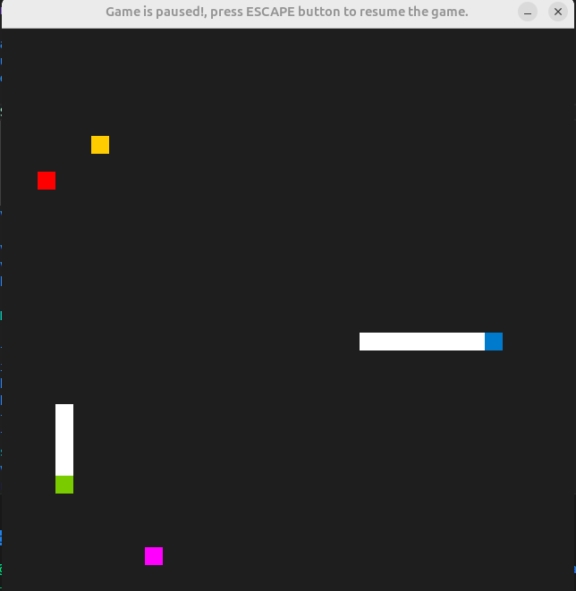

# CPPND: Capstone Snake Game Example

This is a starter repo for the Capstone project in the [Udacity C++ Nanodegree Program](https://www.udacity.com/course/c-plus-plus-nanodegree--nd213). The code for this repo was inspired by [this](https://codereview.stackexchange.com/questions/212296/snake-game-in-c-with-sdl) excellent StackOverflow post and set of responses.

The Capstone Project allows you to integrate what you've learned throughout this program. This project will become an important part of your portfolio to share with current and future colleagues and employers.

In this project, you can build your own C++ application or extend this Snake game, following the principles you have learned throughout this Nanodegree Program. This project will demonstrate that you can independently create applications using a wide range of C++ features.

## Dependencies for Running Locally
* cmake >= 3.7
  * All OSes: [click here for installation instructions](https://cmake.org/install/)
* make >= 4.1 (Linux, Mac), 3.81 (Windows)
  * Linux: make is installed by default on most Linux distros
  * Mac: [install Xcode command line tools to get make](https://developer.apple.com/xcode/features/)
  * Windows: [Click here for installation instructions](http://gnuwin32.sourceforge.net/packages/make.htm)
* SDL2 >= 2.0
  * All installation instructions can be found [here](https://wiki.libsdl.org/Installation)
  >Note that for Linux, an `apt` or `apt-get` installation is preferred to building from source. 
* gcc/g++ >= 5.4
  * Linux: gcc / g++ is installed by default on most Linux distros
  * Mac: same deal as make - [install Xcode command line tools](https://developer.apple.com/xcode/features/)
  * Windows: recommend using [MinGW](http://www.mingw.org/)

## Basic Build Instructions

1. Clone this repo.
2. Make a build directory in the top level directory: `mkdir build && cd build`
3. Compile: `cmake .. && make`
4. Run it: `./SnakeGame`.

## Game New Features
1. Multiplier game with two snakes (Note that this is done by two child threads that run asynchronously) one is controlled by (Right, left, up, and down buttons) and the second controller is controlled by (d, a, w, and s).  (Note that buttons can be configured easily in the game constructor). TO BE CONFIGURED FROM THE CONFIGURATION TEXT FILE SOON.....
2. Poison food is added to freeze the snake for 3 seconds to give the privilege to the second player to win more points.
3. Shrinking food is added to decrease the snake size and the player score until the snake dies if the size becomes zero.
4. The highest score is restored from a text file in the project folder and after the game is finalized, if the winner's score is higher than the highest score, the file will be updated with a new score. (Note that this is done by abstraction methodology through new classes with APIs)
5. The two players will lose if the two snakes hit each other. 
6. The game can be paused by the escape button.

## The New Game Play

## Project Rubrics Discussed

In order to have a successful submission, we are supposed to address at least 5 optional rubrics given in the capstone project. 

| Category/Rubric                                              | Explanation and link(s)                                      |
| ------------------------------------------------------------ | ------------------------------------------------------------ |
| **Loops, Functions, I/O** The project demonstrates an understanding of C++ functions and control structures. | The project is well organized demonstrating a deep understanding of C++ functions and control structure by decomposing the functionalities into small functions to ease the testing and decrease the complexity |
| **Loops, Functions, I/O** The project reads data from the file and processes the data, or the program writes data to a file. | The code is structured from 5 classes one of them called [ScoreHandler](https://github.com/MuhammadHossam/Snake-Game-CPP/blob/main/src/ScoreHandler.h), which reads the score.txt file and updates the latest highest score, then check the new score of the winner after the game is finished and save it in the file in case it is higher than the stored highest score.|
| **Loops, Functions, I/O** The project uses data structures and immutable variables. | The code uses a vector of threads in the class [Game](https://github.com/MuhammadHossam/Snake-Game-CPP/blob/main/src/game.h), to push the threads in it to be joined at the game destructor through the lambda function to ensure that the parent main thread will not go out of scope before the two threads are joined and finalized their execution |

| **Object Oriented Programming**  One or more classes are added to the project with appropriate access specifiers for class members. | The code is constructed from 5 classes [Game](https://github.com/MuhammadHossam/Snake-Game-CPP/blob/main/src/game.h), [Controller](https://github.com/MuhammadHossam/Snake-Game-CPP/blob/main/src/controller.h), [renderer](https://github.com/MuhammadHossam/Snake-Game-CPP/blob/main/src/renderer.h), [ScoreHandler](https://github.com/MuhammadHossam/Snake-Game-CPP/blob/main/src/ScoreHandler.h), and [snake](https://github.com/MuhammadHossam/Snake-Game-CPP/blob/main/src/snake.h). All classes are well organized with private and public attributes, and the private variables are accessed through Getters/Setters to achieve the invariant member methods|.
| **Object Oriented Programming**  Class constructors utilize member initialization lists. | All classes [Game](https://github.com/MuhammadHossam/Snake-Game-CPP/blob/main/src/game.h), [Controller](https://github.com/MuhammadHossam/Snake-Game-CPP/blob/main/src/controller.h), [renderer](https://github.com/MuhammadHossam/Snake-Game-CPP/blob/main/src/renderer.h), [ScoreHandler](https://github.com/MuhammadHossam/Snake-Game-CPP/blob/main/src/ScoreHandler.h), and [snake](https://github.com/MuhammadHossam/Snake-Game-CPP/blob/main/src/snake.h) are constructed through intialization lists.|
| **Object Oriented Programming**  Classes abstract implementation details from their interfaces. | All classes [Game](https://github.com/MuhammadHossam/Snake-Game-CPP/blob/main/src/game.h), [Controller](https://github.com/MuhammadHossam/Snake-Game-CPP/blob/main/src/controller.h), [renderer](https://github.com/MuhammadHossam/Snake-Game-CPP/blob/main/src/renderer.h), [ScoreHandler](https://github.com/MuhammadHossam/Snake-Game-CPP/blob/main/src/ScoreHandler.h), and [snake](https://github.com/MuhammadHossam/Snake-Game-CPP/blob/main/src/snake.h) have abstracted APIs with well defined and clear names to abstract the implementation from the user and also encapsulate the functionality inside the corresponding API.|
| **Memory Management**  The project makes use of references in function declarations. | Class [Game](https://github.com/MuhammadHossam/Snake-Game-CPP/blob/main/src/game.h) contains an update method which passes renderer instance by reference, and class [Controller](https://github.com/MuhammadHossam/Snake-Game-CPP/blob/main/src/controller.h) contains two methods (ChangeDirection & HandleInput) that accept references and also class [snake](https://github.com/MuhammadHossam/Snake-Game-CPP/blob/main/src/snake.h) have multiple methods that are accepting references.
| **Memory Management**  The project uses destructors appropriately. | Class [Game](https://github.com/MuhammadHossam/Snake-Game-CPP/blob/main/src/game.h) contains two shared pointers to snake instances that are dynamically allocated at the game constructor and are automatically dynamically allocated when the game is finalized and the game instance is destructed, and also the game destructs the threads through the lambda function by joining all threads.|
| **Memory Management**  The project uses scope / Resource Acquisition Initialization (RAII) where appropriate. | Class [Game](https://github.com/MuhammadHossam/Snake-Game-CPP/blob/main/src/game.h) contains two shared pointers to snake instances that are dynamically allocated at the game constructor and are automatically dynamically allocated when the game is finalized and the game instance is destructed.|
| **Memory Management**  The project follows the Rule of 5. | Class [renderer](https://github.com/MuhammadHossam/Snake-Game-CPP/blob/main/src/renderer.h) is moved from the main function to the game run method since no need to have multiple copies, since the main will never use this renderer instance anymore, so the move constructor is implemented and the other 4 constructors (Copy, copy by assignment, move by assignment, constructor) are implemented to achieve the rule of 5.|
| **Memory Management**  The project uses move semantics to move data instead of copying it, where possible. | Class [renderer](https://github.com/MuhammadHossam/Snake-Game-CPP/blob/main/src/renderer.h) is moved from the main function to the game run method since no need to have multiple copies, since the main will never use this renderer instance anymore, so the renderer instance is moved through the move constructor by calling (std::move).|
| **Memory Management**  The project uses smart pointers instead of raw pointers.| Class [Game](https://github.com/MuhammadHossam/Snake-Game-CPP/blob/main/src/game.h) contains two shared pointers to snake instances that are dynamically allocated at the game constructor and are automatically dynamically allocated when the game is finalized and the game instance is destructed, the shared pointer is used since the shared pointer can be copied without any issues and this feature is needed since the snake instances are passed across the code multiple times, so the shared pointer is the optimum solution without any fear of memory dump or segmentation fault.|

| **Concurrency**  The project uses multithreading.| The project has three threads: the main parent thread which runs the game (The update and renderer only) while the controller handler is used by creating async task for each player to have multiplier game play to can handle the input more efficiently.|
| **Concurrency**  A mutex or lock is used in the project.| The game has a pause feature through the escape button and when this is done by any of the players, the controller handler corresponding to such player will set a shared variable which is accessed by the three threads that need protection. a mutex and lock are added to protect this shared variable.|

## CC Attribution-ShareAlike 4.0 International

Shield: [![CC BY-SA 4.0][cc-by-sa-shield]][cc-by-sa]

This work is licensed under a
[Creative Commons Attribution-ShareAlike 4.0 International License][cc-by-sa].

[![CC BY-SA 4.0][cc-by-sa-image]][cc-by-sa]

[cc-by-sa]: http://creativecommons.org/licenses/by-sa/4.0/
[cc-by-sa-image]: https://licensebuttons.net/l/by-sa/4.0/88x31.png
[cc-by-sa-shield]: https://img.shields.io/badge/License-CC%20BY--SA%204.0-lightgrey.svg
